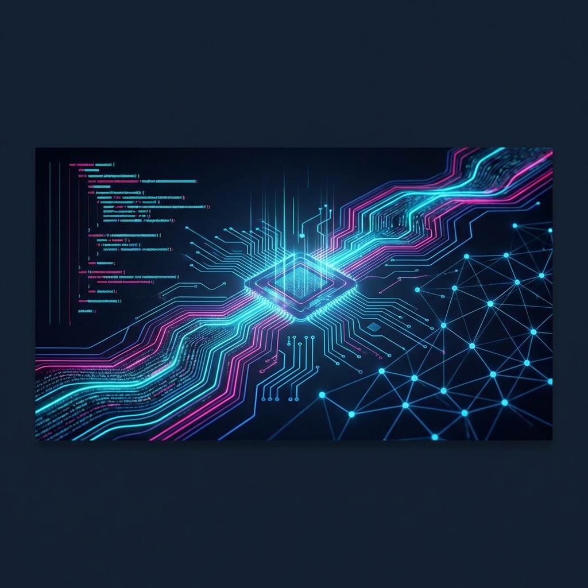

# 🎓 Computer Engineering Degree | Grado en Ingeniería Informática 💻

Welcome to the comprehensive repository of my **Computer Engineering** journey! This space serves as a curated showcase of the projects, academic work, and technical challenges I've tackled throughout my degree.

---

### 🚀 Featured Project: NutreMe (TFM)
**NutreMe** is my final degree project (*Trabajo Fin de Grado*). It's a full-stack nutrition assistant built with a modern stack.
- 🥗 **Frontend**: Angular 14, NgRx, Chart.js.
- 🔙 **Backend**: Node.js, Express, MongoDB, TypeScript.
- 🔍 **Check it out**: [Go to NutreMe folder](./0__TFM)

---

### 📂 Repository Overview

| Project | Description | Tech Stack | Status |
| :--- | :--- | :--- | :--- |
| **[NutreMe (TFM)](./0__TFM)** | Personalized Nutrition Assistant. | `Angular`, `Node.js`, `MongoDB` | ✅ Done |
| **[Compilador Fase 1](./CompiladorFase1)** | Lexical & Syntactic analysis (Phase 1). | `Java`, `Lex`, `Yacc` | ✅ Done |
| **[Compilador Fase 2](./CompiladorFase2)** | Semantic analysis & Code generation (Phase 2). | `Java`, `CUP` | ✅ Done |
| **[Simulación Nube RMI](./SimulacionNubeJavaRMI)** | Cloud simulation using Java RMI. | `Java`, `RMI` | ✅ Done |
| **[Tienda Electrodomésticos](./TiendaElectrodomesticosJAVA)** | E-commerce logic implementation. | `Java` | ✅ Done |
| **[Linux Bash Scripting](./LinuxBashScripting)** | Automation scripts and process control. | `Bash`, `Shell` | ✅ Done |

---

### 🛠️ Skills & Technologies

  
  
  
  
  
  
  
  

---

### 📫 Let's Connect!

**Michael Laudrup Luis González**
- 💼 **LinkedIn**: [\[Your Profile Link Here\]](https://www.linkedin.com/in/michael-laudrup/)
- 🐙 **GitHub**: [@MichaeLaudrup](https://github.com/MichaeLaudrup)

---

  <i>"Code is like humor. When you have to explain it, it’s bad."</i> – Cory House

